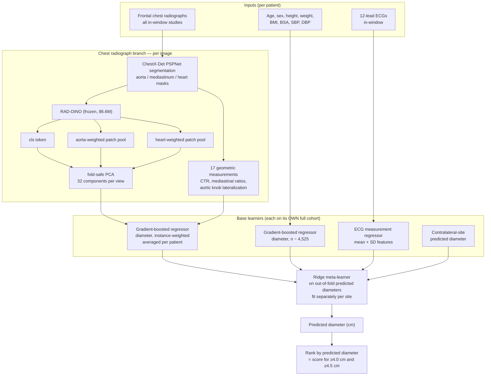

# Multimodal Prediction of Aortic Root and Ascending Aorta Diameter from Chest Radiographs, Electrocardiograms and Routine Clinical Variables

**Progress report — preliminary Methods, Results and Discussion**
Reporting period: 18 June – 22 July 2026
Prepared: 23 July 2026

---

## Abstract

We are developing a model that estimates aortic root and ascending aorta diameter — and thereby screens for aortic dilation — from data acquired for other reasons: a frontal chest radiograph, a 12-lead ECG, and routine clinical variables. The reference standard is transthoracic echocardiography. Over the reporting period the model advanced from AUROC 0.630 (root) / 0.683 (ascending) for dilation ≥4.0 cm to **0.815 ± 0.006 / 0.806 ± 0.009**, validated by repeated cross-validation over five independent fold assignments. Three changes account for most of the gain: fold-safe dimensionality reduction of the frozen encoder embeddings; the addition of explicit geometric measurements derived from anatomical segmentation of the radiograph; and a reframing of the classification task as ranking by a predicted continuous diameter rather than fitting a classifier to 8–48 positive cases.

Two negative findings are equally load-bearing for the manuscript. The ECG contributes essentially nothing once body size and the chest radiograph are in the model, under two independent ECG encoders and an expanded 2,874-patient training set. And end-to-end deep fusion, as well as LoRA fine-tuning of the imaging backbone, both underperform frozen features with regularized gradient boosting at this cohort size.

---

## 1. Dataset and preprocessing pipeline

### 1.1 Sources

| Source | Role | Scale used |
|---|---|---|
| MIMIC-IV-Echo (`structured-measurement.csv`) | Reference standard: aortic diameters | 4,532 patients after QC |
| MIMIC-CXR-JPG | Chest radiographs | 2,792 in-window studies; 1,798 frontal with segmentation |
| MIMIC-IV-ECG (matched subset) | 12-lead waveforms | 2,877 patients in window |
| MIMIC-IV `hosp` (`patients`, `omr`) | Age, sex, anthropometrics, blood pressure | 4,579 patients |
| MIMIC-IV-ECG `machine_measurements.csv` | Explicit ECG intervals, axes, machine flags | 2,888 patients |

Targets are `sinus_diam_cm` → aortic root and `ascending_diam_cm` → ascending aorta, already in centimetres. Each patient's echo date is the minimum `measurement_datetime`.

### 1.2 Cohort construction and temporal alignment

The echocardiogram is the sole temporal anchor. ECG and chest radiograph are each matched to the echo *independently* — neither is anchored to the other. This was verified directly in the linkage code during the reporting period; in practice the ECG-to-radiograph separation is a median of 1 day (90th percentile 92 days, only 1% more than 180 days apart), so the unconstrained pairing is not a practical concern.

The primary analysis cohort is the **tri-modal overlap under a symmetric ±180-day window: n = 522 patients**. An audit performed this period corrected an earlier misconception: n≈522 is the true tri-modal temporal overlap, not an artifact of incomplete image download. All in-window frontal radiographs for these patients are already on disk. The binding constraint is temporal co-occurrence, not data availability.

**Label distribution in the primary cohort** (this is the central statistical difficulty of the project):

| Endpoint | Positives | Prevalence |
|---|---|---|
| Root ≥4.0 cm | 32 / 522 | 6.1% |
| Root ≥4.5 cm | 8 / 522 | 1.5% |
| Root ≥5.0 cm | 1 / 522 | 0.2% — not trainable |
| Ascending ≥4.0 cm | 48 / 513 | 9.4% |
| Ascending ≥4.5 cm | 10 / 513 | 1.9% |
| Ascending ≥5.0 cm | 2 / 513 | 0.4% — not trainable |

Mean root diameter 3.26 ± 0.47 cm; mean ascending 3.24 ± 0.47 cm. Radiograph views in the single-image cohort: 375 PA, 134 AP.

Crucially, **each modality's base learner is trained on its own full cohort**, not on the 522. The EHR learner sees ~4,525 patients, the ECG learner 2,874, the radiograph learner all 2,792 in-window images. Only the fused evaluation is restricted to the 522, using out-of-fold predictions so that no patient's own data ever informs its prediction.

### 1.3 Window-design audit

Eight cohort designs were evaluated (two temporal directions × four radiograph windows, ECG fixed at ±180 days). Feature extraction was run once over a ±450-day superset (2,698 frontal radiographs from 684 patients, 99.9% segmentation success); each design is a filter on that superset.

| Design | n | Root + | Asc + | Images/patient |
|---|---|---|---|---|
| Pre-echo only, ≤180 d | 381 | 19 | 36 | 1.9 |
| Pre-echo only, ≤270 d | 403 | 20 | 37 | 2.0 |
| **Pre-echo only, ≤365 d** | **427** | 21 | 38 | 2.0 |
| Pre-echo only, ≤450 d | 439 | 22 | 39 | 2.1 |
| Symmetric ±180 d | 509 | 32 | 45 | 3.5 |
| Symmetric ±270 d | 552 | 35 | 47 | 3.7 |
| Symmetric ±365 d | 602 | 40 | 53 | 3.9 |
| Symmetric ±450 d | 630 | 40 | 60 | 4.1 |

See **`figures/fig5_window_cohort_sizes.png`**. Loosening the radiograph window is the only lever that adds patients; tightening the ECG window is nearly free because ECGs are plentiful.

### 1.4 Preprocessing per modality

**Chest radiograph.** Every in-window frontal study is segmented with a pretrained ChestX-Det PSPNet (torchxrayvision) to obtain aorta, mediastinum and heart masks. From these we derive (i) a per-image anatomy region of interest — the union box of aorta ∪ mediastinum ∪ heart with 6% padding — and (ii) 17 explicit geometric measurements. The image is then passed through RAD-DINO (86.6 M parameters, 12 blocks, frozen). We retain three pooled views per image: the `cls` token, an aorta-weighted patch pool (`aortapool`), and a heart-weighted patch pool (`heartpool`), where the segmentation mask supplies the pooling weights — a *soft* region of interest that is spatially selective without cropping away context.

The segmenter is frontal-only: PA/AP segmentation succeeds ~99% of the time, lateral ~15%. Laterals (28% of instances) are therefore excluded rather than allowed to fall back to whole-image.

The 17 geometric features are `thoracic_width`, `cardiothoracic_ratio`, `mediastinal_ratio`, `med_upper_ratio`, `med_mid_ratio`, `med_lower_ratio`, `med_upper_over_lower`, `aorta_w_frac`, `aorta_h_frac`, `aorta_area_frac`, `aorta_area_over_thorax`, `aorta_knob_lateral`, `aorta_centroid_offset`, `aorta_top_y`, `heart_w_frac`, `heart_area_ratio`, `med_area_ratio`. Medians are anatomically plausible — cardiothoracic ratio 0.531 (MIMIC is ICU-heavy with AP portable films, which magnify the heart), upper mediastinum narrower than lower (0.186 vs 0.268) — and the geometry computations were unit-tested against synthetic masks.

**ECG.** Two frozen encoders were evaluated: PCLR (contrastive, 320-dim) and xECG (xLSTM-based, 1024-dim `cls` from average pooling; contract (B, L, 12) at 100 Hz, lead order I…V6, missing leads zero-filled, no input normalization). Separately, 33 explicit features are derived from the machine measurements table — PR/QRS/QT/QTc, heart rate, P/QRS/T axes, QRS-T angle, plus machine-report flags (LVH 19.7%, left atrial enlargement 14.5%, atrial fibrillation 21.7%, bundle branch block, ST-T changes) — computed as both the mean **and the standard deviation** across each patient's in-window ECGs.

**Clinical variables.** Age, sex, height, weight, BMI, body surface area, systolic and diastolic blood pressure, with explicit missingness indicators — deliberately kept minimal.

### 1.5 Evaluation protocol

All fused results are 5-fold out-of-fold predictions over the 522-patient cohort using an **immutable fold assignment file** (`pretrained_checkpoints/fold_assignments.csv`), so every model in this report is scored on identical splits and paired comparisons are legitimate. Confidence intervals are 2,000-sample patient-level bootstraps; model-versus-model and model-versus-baseline comparisons use paired bootstrap differences, with an asterisk denoting a 95% CI excluding zero.

Any dimensionality reduction (PCA) is fit **inside the training fold only**. For multi-instance radiograph learners, folds are assigned at the patient level, instances are weighted 1/nᵢ so each patient contributes equally, and test-time predictions are averaged across a patient's images.

Since 2026-07-22, headline numbers are additionally reported as the **mean ± SD across five independent fold-seed assignments** (repeated cross-validation), for reasons documented in §4.4.

---

## 2. Model architecture evolution

### 2.1 Current architecture



The design is deliberately **late fusion over frozen encoders**. Every backbone is frozen; the only trained components are per-fold PCA, the gradient-boosted diameter regressors, and a ridge meta-learner. The end-to-end path from the v2 codebase (ResNet1D ECG encoder + end-to-end RAD-DINO + a 3-layer transformer fusion module) is deprecated — it collapsed to predicting the mean.

### 2.2 Chronology

| # | Version | Date | Key technical change | Root ≥4.0 | Asc ≥4.0 |
|---|---|---|---|---|---|
| 1 | GBDT early fusion | 18 Jun | Concatenate all frozen embeddings (1,100 dims) → HistGradientBoosting | 0.630 | 0.683 |
| 2 | Deep fusion transformer | 18 Jun | Joint transformer over modality tokens, CORAL ordinal head | 0.651 | 0.669 |
| 3 | Late fusion v1 | 18 Jun | Per-modality learners on full per-modality cohorts → stacked meta-learner | 0.728 | 0.678 |
| 4 | Late fusion v2 | 9 Jul | + continuous EHR diameter as meta-feature; + region-of-interest radiograph learner; nested inner-CV meta tuning | 0.769 | 0.695 |
| 5 | Combined stack | 16 Jul | + multi-instance radiographs; + anatomy-driven region of interest; + fold-safe PCA(32); frontal views only | 0.772 | 0.756 |
| 6 | Geometry stack | 22 Jul | + 17 geometric features; + three-view patch pooling; **regression-derived scoring** | 0.809 ± 0.007 | 0.790 ± 0.014 |
| 7 | + cross-site + ECG measurements | 22 Jul | + contralateral-site predicted diameter; + ECG interval mean *and* SD | **0.815 ± 0.006** | **0.806 ± 0.009** |

Versions 1–5 are single-split numbers on the fixed fold assignment; versions 6–7 are mean ± SD over five fold seeds. See **`figures/fig1_model_evolution.png`** for this progression against the clinical-variable baseline, on both the classification and the diameter-regression endpoint.

### 2.3 What each change did, and why

**Fold-safe PCA (v5).** Concatenating raw frozen features gives ~1,100 dimensions over ~420 training rows. Reducing each modality block to 16–32 principal components, fit inside the training fold, was the single cheapest large improvement. At equal n, root diameter R² rose from 0.11 to 0.31, and for the ascending aorta *every* PCA configuration significantly beat the equal-n clinical-variable baseline (**`figures/fig8_pca_reduction.png`**). Supervised reduction (PLS) was also tried and **overfits badly** — negative test R². Use unsupervised PCA.

**Anatomy-driven region of interest (v5).** Replacing a hard-coded crop box with a per-patient union box derived from segmentation improved the ascending-aorta radiograph learner. Notably, an aggressive aorta-only crop is *worse* than the whole image (**`figures/fig7_cxr_representation.png`**, panel a) — the surrounding cardiac silhouette is informative context, and over-zooming discards it. The optimal region is also site-specific: the root prefers a lower, more central box.

**Multi-instance radiographs (v5).** Using all in-window images per patient rather than one best image strengthened the radiograph learner substantially (ascending ≥4.0 AUROC 0.706 → 0.755; root diameter R² 0.17 → 0.26). But this only works inside a late-fusion base learner: early-concatenating multi-instance imaging with the tabular clinical block **significantly hurt** the ascending endpoint (0.690 → 0.608, Δ −0.082 [−0.161, −0.004]*), because repeating a patient's clinical row across each of its images distorts the tabular signal.

**Engineered geometry (v6).** Seventeen measurements a radiologist actually reads off a film. Geometry alone is weaker than the learned embedding, yet the two together beat either — they are orthogonal (ViT texture and appearance versus explicit spatial measurement). See **`figures/fig7_cxr_representation.png`**, panels b–c.

**Regression-derived scoring (v6).** The largest single gain of the period; discussed in §3.3.

**Three-view patch pooling (v6).** Pooling RAD-DINO patch tokens with the segmentation mask as weights. The aorta pool *alone* is worse than the anatomy crop; only the combination of `cls` + aorta pool + heart pool helps. This is the same complementarity principle as the geometry result: several different summaries of one image beat any single one.

**Cross-site transfer (v7).** Root and ascending diameters correlate at r = 0.576. Feeding each site's out-of-fold predicted diameter into the *other* site's stack helped asymmetrically and counter-intuitively: the ascending aorta borrows from the root (0.790 → 0.805, R² 0.221 → 0.233, consistent across all five seeds), not the reverse. The root is better predicted overall — via body size — so it is the one with information to lend.

**ECG temporal variability (v7).** Adding the standard deviation of ECG intervals across a patient's in-window recordings roughly doubled the ECG-only signal (root R² 0.033 → 0.062, ascending 0.019 → 0.043). In the full stack the increment is small (root 0.810 → 0.815) but consistent and costless.

---

## 3. Quantitative results

### 3.1 Headline

Primary cohort n = 522, 5-fold out-of-fold, mean ± SD over five fold seeds:

| Endpoint | AUROC | Diameter R² | Diameter MAE (cm) |
|---|---|---|---|
| Root ≥4.0 cm | **0.815 ± 0.006** | 0.358 ± 0.009 | 0.292 ± 0.003 |
| Root ≥4.5 cm | 0.900 ± 0.020 | — | — |
| Ascending ≥4.0 cm | **0.806 ± 0.009** | 0.235 ± 0.012 | 0.318 ± 0.002 |
| Ascending ≥4.5 cm | 0.869 ± 0.022 | — | — |

### 3.2 Comparison against the clinical-variable baseline

The hardest baseline is a gradient-boosted model on age, sex, and body size trained on the **full** ~4,525-patient cohort — roughly nine times the fused cohort. It is the honest floor, and for the aortic root it is a strong one.

| Endpoint | Clinical baseline | Best multimodal (v7) | Difference |
|---|---|---|---|
| Root ≥4.0 cm | 0.776 [0.692, 0.858] | 0.815 | +0.039 |
| Root diameter R² | 0.309 [0.230, 0.376] | 0.358 | +0.049 |
| Ascending ≥4.0 cm | 0.668 [0.590, 0.747] | 0.806 | +0.138 |
| Ascending diameter R² | 0.143 [0.061, 0.217] | 0.235 | +0.092 |

The v7 differences above are point differences between repeated-CV means and the baseline; **a paired bootstrap of v6/v7 against the baseline has not yet been run** and should be completed before drafting. The formally tested wins are at v4 and v5:

- **v4 (late fusion v2)** produced the project's first positive delta whose paired CI excluded zero: ascending diameter R² 0.187 vs 0.143, Δ **+0.044 [0.004, 0.087]\***. It was also the first version that no longer *lost* anywhere — v1's significant root ≥4.0 loss (−0.048) became a tie (−0.007 [−0.054, 0.036]).
- **v5 (combined stack)** was the first significant on two independent ascending endpoints simultaneously: classification 0.756 vs 0.668, Δ **+0.081 [0.007, 0.158]\***, and diameter regression R² 0.203 vs 0.143, Δ **+0.060 [0.014, 0.103]\***.

Versions 6–7 extended the margin on both.

### 3.3 Regression-derived classification

Rather than fitting a classifier to 8–48 positive cases, we regress the continuous diameter using all 522 graded labels and rank patients by the prediction.

| Endpoint | Positives | Direct classifier | Regression-derived | Paired Δ |
|---|---|---|---|---|
| Root ≥4.0 cm | 32 | 0.767 | **0.809** | +0.042 [−0.005, 0.091] |
| Root ≥4.5 cm | 8 | 0.872 | **0.906** | +0.033 [−0.012, 0.085] |
| Ascending ≥4.0 cm | 48 | 0.777 | 0.784 | +0.006 [−0.031, 0.046] |
| Ascending ≥4.5 cm | 10 | 0.699 | **0.859** | **+0.160 [0.034, 0.298]\*** |

Per-modality the effect is larger still: the radiograph learner alone goes from 0.681 to 0.901 on ascending ≥4.5 cm.

The mechanism is identified by the pattern rather than asserted: **the gain scales inversely with positive count** — +0.160 at 10 positives, +0.006 at 48 (**`figures/fig3_regression_derived.png`**). The binary label was discarding most of the available information; 3.9 cm and 2.5 cm are both "negative". The practical consequence is that **diameter R² is now the direct lever on AUROC**, which redirects all future modelling effort onto the regression task.

### 3.4 Where the signal lives

| Learner | Root ≥4.0 | Ascending ≥4.0 |
|---|---|---|
| Chest radiograph only | 0.775 [0.679, 0.866] | **0.805 [0.735, 0.870]** |
| Clinical variables only (full cohort) | 0.769 [0.688, 0.845] | 0.667 [0.587, 0.744] |
| Radiograph + clinical stack | **0.809 [0.723, 0.886]** | 0.784 [0.711, 0.853] |

This asymmetry (**`figures/fig2_modality_contribution.png`**) is anatomically expected and is one of the more satisfying results in the project. The ascending aorta and arch form the right mediastinal border and are directly visible on a frontal film — geometry alone reaches 0.696 there. The aortic root sits behind the heart and sternum and is *not* visible on a frontal projection — geometry alone reaches only 0.585 — so root prediction is largely a body-size phenomenon, which is exactly what the clinical variables encode.

### 3.5 Window design

Across all eight cohort designs, root ≥4.0 AUROC stays within 0.807–0.832 and ascending within 0.776–0.810 (**`figures/fig4_window_designs.png`**). Nothing collapses. This is the strongest robustness evidence the project has: the model is not tuned to one cohort definition.

Two findings required the *common-subset* evaluation, in which every design is scored on the same 381 patients:

1. **Apparent gains from loosening the symmetric window are mostly case mix.** On the root, symmetric own-cohort performance rises 0.807 → 0.832 as the window loosens, but on the common patients it is flat (0.822 → 0.823). By contrast the pre-echo-only arm rises on the common set too (0.821 → 0.832), meaning the extra prior imaging genuinely improved the model. Without the common-subset evaluation we would have misread this as a modelling gain.
2. **Restricting to pre-echo data costs almost nothing.** Pre-only with a ≤365-day radiograph window gives root 0.828 (identical to the symmetric design) and ascending 0.789 (−0.02). The medically legitimate, screening-valid framing is not a performance sacrifice.

**Recommended primary design for the manuscript: pre-echo only, ECG ≤180 days, radiograph ≤365 days before the echo** (n = 427; root 0.828 ± 0.011, ascending 0.789 ± 0.020, root diameter R² 0.341). Every input strictly precedes the reference standard, supporting a genuine early-screening claim. A 365-day radiograph window is clinically defensible because dilated aortas grow roughly 0.1 cm/year, bounding worst-case label drift at ~0.1 cm against a 4.0 cm threshold.

---

## 4. Qualitative insights and analysis

### 4.1 Fusion cannot exceed its best input when the modalities are redundant

A recurring expectation was that late fusion should beat every single modality. It does not here, and the reason is now clear. Per site the modalities are largely *redundant* rather than complementary: for the ascending aorta the radiograph reaches 0.797 and the clinical block 0.668; for the root the ordering reverses. Late fusion only exceeds its best input when the inputs carry genuinely complementary signal. For ascending ≥4.0 cm the radiograph learner alone (0.805) is statistically indistinguishable from the full stack (0.784–0.806).

Worse, at ~48 positives a learned logistic meta-learner actively **dilutes** a strong base learner (ascending 0.797 → 0.777). The stack earns its place by combining both sites into one deployable model and by carrying the root, not by beating the radiograph on the ascending aorta.

The complementarity that *does* exist is within the radiograph itself: embedding versus geometry, and `cls` versus aorta pool versus heart pool. Different summaries of the same image are complementary in a way that different organs' signals about the same body size are not.

### 4.2 The ECG is redundant, and this is a real finding rather than a failed implementation

We took this seriously before concluding it. Three separate lines of evidence:

- **Expanded training data.** Training the ECG base learner on all 2,874 ECG-echo patients rather than 522 lifted ECG-only root ≥4.0 from 0.577 to **0.680** — so the ECG is data-starved, not signal-free, and a standalone ECG-only root screen is defensible on its own. But with a learned meta-learner it adds ~0 beyond clinical + radiograph (root Δ −0.002, root R² Δ +0.001, ascending Δ −0.012).
- **A second encoder.** xECG (xLSTM) was integrated specifically to rule out a PCLR-specific artifact, after an audit found PCLR preprocessing interpolates the whole recording to 4,096 samples with no amplitude normalization. xECG is also redundant. The ceiling is redundancy, not encoder quality.
- **Explicit measurements.** Machine-derived intervals, axes and flags — a completely different feature family from any learned embedding — are also weak alone (root R² 0.033) and add only +0.005 in the full stack.

The interpretation is physiological: the ECG's aortic information is carried by left ventricular hypertrophy and chamber-size correlates, which are already captured by body size (clinical block) and the cardiac silhouette (radiograph). The one place the ECG showed independent signal is **temporal variability** — the SD of intervals across a patient's recordings roughly doubles the ECG-only R². That supports the temporal hypothesis at the modality level even though it does not survive into the full stack.

### 4.3 Model capacity is not the bottleneck; cohort size is

Three independent attempts to add capacity all lost to frozen features with regularized gradient boosting:

- **Deep transformer fusion** trails the PCA-reduced gradient-boosted model everywhere. A suspected fix — selecting on validation loss instead of validation AUROC, since the inner validation split holds only ~4 positives — was implemented and **regressed** performance (root 0.651 → 0.588); it was reverted.
- **LoRA fine-tuning of RAD-DINO** underperformed the frozen features even in a favourable setup (dense diameter target, 1,798 instances, 0.30 M trainable parameters, patient-level folds, early stopping): root R² 0.152 versus 0.287 frozen. This replicates the earlier v2 finding.
- **Supervised dimensionality reduction (PLS)** overfits to negative R².

At n = 522 with 8–48 positives, the winning move has consistently been to *add information* (more images per patient, orthogonal feature families, a denser label) rather than to add parameters.

### 4.4 Two methodological failure modes we caught, and one we should have caught earlier

**Discrete model selection on sparse binary endpoints is unusable at this n.** An inner-cross-validation selector choosing among fusion strategies made the root *significantly worse* (0.776 → 0.718). With ~32 positives split across three inner folds, each inner validation set holds about two positives, so the selector chooses on noise. The identical selector was perfectly stable — 5/5 folds — on the dense regression target. The rule adopted: never perform discrete selection on the sparse binary endpoint.

**Single-split variant comparisons are not trustworthy.** After evaluating roughly six representation variants across two sites on one fixed fold assignment, no delta was significant — a textbook setup for overfitting the cross-validation itself. Re-running two locked configurations under five fold seeds reversed the ranking: on the single split, configuration A led at the root (0.809 vs 0.797) and would have shipped; across seeds, configuration B wins at *both* sites with lower variance (**`figures/fig6_repeated_cv_stability.png`**). Repeated cross-validation is now mandatory before adopting any variant.

**A standard augmentation would have been actively harmful.** Horizontal flipping is routine in chest-radiograph pipelines. Here the aortic arch and knob are left-sided, and the geometry features encode knob lateralization explicitly, so flipping would destroy the very signal the model relies on. It was never enabled, but it is worth stating in the manuscript as a domain-specific caution.

### 4.5 Limitations

- **n = 522 with 8–48 positives.** The ascending ≥4.0 delta against the clinical baseline had a CI lower bound of ~0.007 at v5 — significant but marginal. Regression R² is the more stable metric and, thanks to regression-derived scoring, it is what drives the AUROC anyway.
- **Severe dilation (≥5.0 cm) is untrainable** at this cohort size: 1 root and 2 ascending positives.
- **Echo date is the minimum measurement datetime per patient.** If the aortic measurement came from a different study than the earliest measurement, the temporal matching anchors to the wrong date. This is a known soft spot that has not yet been quantified.
- **Single centre, ICU-heavy.** The cardiothoracic ratio median of 0.531 reflects portable AP films. External validation is untested.
- **No prospective or reader comparison.** We do not yet know how the model compares to a radiologist reading the same film.
- **Adjacent window designs differ by less than one standard deviation.** The trustworthy claims are the three qualitative findings in §3.5, not the ranking of individual cells.

---

## 5. Next steps and manuscript recommendations

### 5.1 Modelling priorities

0. **Run the paired bootstrap of v6/v7 against the clinical baseline** (§3.2). Every earlier version was tested this way; the two newest are not, and the headline claim needs it.
1. **Rebuild the cohort under modality-specific windows.** This is the single biggest remaining lever. Radiograph ≤365 days with ECG at ±180 days adds ~18% more patients; ≤730 days adds ~48% more patients and ~51% more ascending positives. This requires re-running `build_cohort` → `cxr_instances` → segmentation, patch-pool and geometry extraction. Note the label-drift trade-off: 365 days is the defensible default, 730 days a sensitivity analysis.
2. **Improve ascending diameter R² (currently 0.221–0.235).** Because scoring is now regression-derived, any regression improvement propagates directly to the screening AUROC. Ascending R² is the weaker of the two sites and the more imaging-driven, so it has the most headroom.
3. **Calibrate a deployable operating point.** We have discrimination but have not yet reported sensitivity/PPV/number-needed-to-echo at a clinically chosen threshold, which is what a screening claim actually requires. The clinical-metrics module (`training/clinical_metrics.py`) already supports this.
4. **Treat AUROC 0.85 as ambitious.** At R² ≈ 0.35, the implied ceiling for thresholding an indirect measurement is approximately where we now are.

### 5.2 Rigor items to complete before drafting

- Lock the primary cohort design (recommend pre-echo only, ECG ≤180 d / radiograph ≤365 d) and re-run every reported model on it, with symmetric ±365 d and pre-only ≤180 d as pre-specified sensitivity analyses.
- Report performance as a function of |Δt| between each input and the echo.
- Quantify the echo-date ambiguity described in §4.5.
- Add a patient-level held-out test split, or state explicitly that all reported numbers are cross-validated rather than held-out.
- Push the `v3-rigor-foundation` branch. Commits `39b8c75` and `c328ce5` are local only; this environment has no GitHub credentials, so `git push -u origin v3-rigor-foundation` must be run interactively.

### 5.3 Proposed manuscript outline

**Title direction.** Opportunistic screening for aortic dilation from routine chest radiographs, with the ECG's non-contribution reported as a finding rather than omitted.

**Framing.** The three-tier structure holds: clinical variables are the lower bound, the multimodal model is the contribution, and echocardiography is the reference. "Does imaging add beyond body size?" is one benchmark, not the thesis.

| Section | Content | Figures |
|---|---|---|
| Introduction | Aortic dilation is asymptomatic and underdiagnosed; echo is not a screening tool; radiographs are ubiquitous | — |
| Methods — data | Cohort construction, temporal anchoring, window design, label distribution | Fig 5 + CONSORT-style flow (to be drawn) |
| Methods — model | Frozen encoders, segmentation-driven regions and geometry, late fusion, regression-derived scoring | Architecture schematic (§2.1) |
| Methods — evaluation | Immutable folds, repeated cross-validation, paired bootstrap | — |
| Results — primary | Both sites, both endpoints, versus clinical baseline | Fig 1, Fig 2 |
| Results — ablations | Regression-derived scoring; radiograph representation; PCA | Fig 3, Fig 7, Fig 8 |
| Results — robustness | Window designs, own versus common subset, repeated CV | Fig 4, Fig 6 |
| Discussion | Site-specific anatomy explains the modality asymmetry; ECG redundancy; why capacity does not help at this n | — |
| Limitations | §4.5 | — |

**Two additional figures to produce before submission:** a CONSORT-style cohort flow diagram, and a qualitative panel showing segmentation masks and derived regions on representative correctly- and incorrectly-predicted cases. The latter is currently the largest gap — the report has no error analysis at the level of individual patients.

---

## Appendix — reproducing this report

```bash
cd "2026 Multi-Modal Project"

# Best model, repeated cross-validation over 5 fold seeds
SEEDS="1,2,3,4,5" sbatch scripts/slurm_geometry_stack.sh

# Figures (reads the frozen results JSONs; safe on the login node)
/scratch4/rsteven1/your_env_name/bin/python3.10 scripts/generate_report_plots.py
```

Training scripts must be submitted through SLURM (partition `shared`, account `rsteven1`, CPU-only with thread counts capped to `$SLURM_CPUS_PER_TASK`). They thrash on the shared login node through OpenMP/BLAS thread over-subscription. `generate_report_plots.py` performs no model fitting and is safe to run directly.

**Figures.** All eight are in `figures/` as 300-dpi PNG and vector SVG.

| File | Content |
|---|---|
| `fig1_model_evolution.png` | Seven model versions × two sites × two endpoints, versus the clinical baseline |
| `fig2_modality_contribution.png` | Radiograph versus clinical versus stack, per site, with bootstrap CIs |
| `fig3_regression_derived.png` | Direct classifier versus regression-derived scoring; gain versus positive count |
| `fig4_window_designs.png` | Eight window designs, own-cohort and common-subset evaluation |
| `fig5_window_cohort_sizes.png` | Patients and ascending positives per window design |
| `fig6_repeated_cv_stability.png` | Per-seed spread for two locked configurations |
| `fig7_cxr_representation.png` | Field of view ablation; embedding versus geometry complementarity |
| `fig8_pca_reduction.png` | Fold-safe PCA configurations at equal n |

**Source records.** `notes/experiments_2026-07-16.md`, `notes/experiments_2026-07-22.md`, `notes/experiments_2026-07-22b_windows.md`, `notes/system_overview_and_analysis.md`, and the per-experiment `outputs/*/results.json`.
