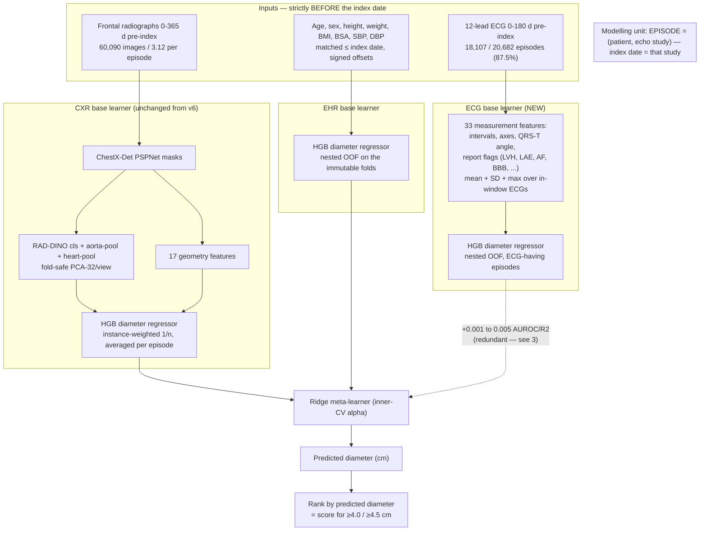

# Progress update — the three-modality experiment and the clinical operating picture

**Companion to `PROGRESS_UPDATE_2026-08-04.md`. Read that first for the episode rebuild, the cohort, the evaluation protocol, and the two-modality (CXR + EHR) headline. This document does not repeat any of it.**
Reporting period: 4–5 August 2026

---

## 0. What this document adds

The 4 August update closed with two explicit gaps (its §9.1 and §9.4):

1. **The ECG was not in the pipeline.** The architecture diagram (§5) drew it as a dotted, "not wired in" branch, and the headline model was `ridge([cxr_diameter, ehr_diameter])` — two modalities. The project's prior claim that "the ECG adds essentially nothing" had **no episode-level evidence**.
2. **Only AUROC was reported.** No confusion matrix, AUPRC, calibration, or operating point — despite the prevalence having dropped to ~4.5%, where AUROC is known to flatter a model.

Both are now closed. This update:

- **wires the ECG in as a third base learner** and measures its incremental value with a paired, patient-clustered test on 18,107 episodes (§2–3);
- reports the **full clinical operating picture** — AUPRC, confusion matrices, and referral-threshold precision/recall/number-needed-to-echo — for the headline model (§4).

The one-line summary: **the three-modality model was built and tested, and the third modality does not earn its place.** The ECG carries real but redundant signal; the deployed model stays two-modality. The negative result the previous report could only assert at n=522 is now demonstrated at n=18,107.

| | 4 Aug report | This report |
|---|---|---|
| Modalities in the model | CXR + EHR (ECG dotted, unbuilt) | **CXR + EHR + ECG, all three built and compared** |
| ECG evidence | none at episode scale | **paired increment on 18,107 episodes** |
| Reported metrics | AUROC (+ ad-hoc AUPRC in prose) | **AUROC, AUPRC, confusion matrices, NNE, Bland–Altman — in code** |

---

## 1. The architecture, with the ECG branch now built

The two radiograph/EHR branches are unchanged from §5 of the previous report. The addition is a third base learner — an ECG **measurement** branch, deliberately mirroring the CXR design (explicit clinical measurements → a diameter regressor), not a learned waveform embedding. All three base learners emit a predicted diameter; the ridge meta-learner combines them; the score is the ranked predicted diameter, exactly as before.



The dotted meta-learner edge is the finding, not a wiring gap: the ECG branch is fully built and fed to the ridge, and its measured contribution is within rounding distance of zero.

---

## 2. The ECG measurement branch

`scripts/extract_ecg_features_episode.py` builds, per episode, the ECG analogue of the CXR geometry features — cart-computed measurements from MIMIC-IV-ECG `machine_measurements.csv`, never used at episode scale before. It is the exact feature set validated in the v7 scratch work, rebuilt with the rebuild's causal discipline.

- **Per ECG**, from the rr/p/qrs/t fiducials: heart rate, RR, PR, QRS duration, QT, QTc (Bazett and Fridericia), P duration, P/QRS/T axes, and the **QRS–T angle** (a repolarization/strain marker). Plus eight binary flags parsed from the machine's diagnostic statement: LVH, left-atrial enlargement, atrial fibrillation/flutter, RBBB, LBBB, ST–T abnormality, prior MI, paced.
- **Per episode**, aggregated over the ECGs in `[index − 180 d, index]` (pre-index only, matching the CXR/EHR windows): the **mean** and the **SD** of each numeric feature — the SD captures within-episode temporal variability, the "the ECG changes tell you more than the ECG" hypothesis — and the **max** of each flag.

**Coverage:** 18,107 of 20,682 episodes (87.5%) have at least one pre-index ECG; 33 features; numeric coverage 97%. Flag prevalences are clinically sane and match the v7 numbers: AF 24.6%, LVH 19.3%, LAE 11.2%, ST–T 13.1%, RBBB 7.5%, LBBB 5.7%, paced 4.2%, MI 0.6%.

---

## 3. Result: the ECG is predictive but redundant

`scripts/train_ecg_increment_episode.py` adds the ECG base learner (nested-OOF HGB diameter regressor, same folds) to the CXR+EHR stack and measures the increment with a **paired patient-clustered bootstrap on the 18,107 ECG-having episodes** — the same episodes scored both ways, so the comparison is clean. Five fold seeds.

| | Root ≥4.0 AUROC | Root diam R² | Asc ≥4.0 AUROC | Asc diam R² |
|---|---|---|---|---|
| **ECG alone** | 0.668 [0.650, 0.687] | 0.085 [0.077, 0.093] | 0.666 [0.647, 0.686] | 0.113 [0.103, 0.122] |
| CXR + EHR (2-modality) | 0.824 [0.811, 0.837] | 0.312 [0.299, 0.324] | 0.805 [0.788, 0.822] | 0.301 [0.287, 0.315] |
| CXR + EHR + ECG (3-modality) | 0.826 [0.813, 0.839] | 0.317 [0.304, 0.329] | 0.806 [0.789, 0.823] | 0.306 [0.293, 0.319] |
| **ECG increment (paired)** | **+0.003 [0.000, 0.005]** | **+0.004 [0.003, 0.006]** | **+0.001 [−0.001, 0.004]** | **+0.005 [0.003, 0.007]** |

(The 2-modality row here is on the 18,107-episode ECG subset, so it differs slightly from the 20,682-episode headline of 0.826 / 0.808.)

The ≥4.5 cm increment is +0.004 [−0.001, 0.010] at both sites.

**Reading it.**

- **The ECG is not noise.** On its own it reaches 0.67 AUROC and R² ~0.09–0.11 — genuinely above chance. Physiologically expected: LVH and chamber enlargement track the same hypertensive/valvular processes that dilate the aorta.
- **But it is redundant.** Added to CXR + EHR, it moves the needle by +0.001 to +0.005. Everything the ECG knows about aortic size is already carried by body size (EHR) and the cardiac silhouette (CXR).
- **Mind the difference between "significant" and "meaningful."** At n = 18,107, a +0.003 [0.000, 0.005] AUROC and a +0.004 [0.003, 0.006] R² have confidence intervals that technically exclude zero. They are also clinically nil. This is the canonical large-sample trap — with enough data, a trivial effect becomes "significant" — and it is a cleaner illustration of it than the AUROC/AUPRC divergence in §4. The reportable conclusion is the **magnitude**, not the interval: the third modality buys nothing worth its complexity.

This is the same conclusion the previous reports reached at n = 522, now on 35× the episodes with intervals tight enough to state as a finding: **the deployed model is CXR + EHR, and the ECG's exclusion is an evidence-based design decision, not a data limitation.**

---

## 4. The clinical operating picture

`scripts/eval_episode.py` reports, from the saved out-of-fold predictions, the metrics AUROC alone hides at 4.5% prevalence. All values are patient-clustered; the model is the two-modality headline stack on all 20,682 episodes.

### 4.1 Discrimination vs. precision

| Endpoint | Positives / prev. | AUROC | **AUPRC** | AUPRC vs floor |
|---|---|---|---|---|
| Root ≥4.0 | 927 / 4.5% | 0.826 | **0.178 [0.159, 0.204]** | +0.056 [0.041, 0.075] |
| Ascending ≥4.0 | 827 / 4.5% | 0.808 | **0.195 [0.171, 0.227]** | +0.093 [0.073, 0.120] |
| Root ≥4.5 | 90 / 0.4% | 0.854 | 0.024 [0.016, 0.040] | +0.012 [0.003, 0.025] |
| Ascending ≥4.5 | 124 / 0.7% | 0.856 | 0.067 [0.039, 0.134] | +0.051 [0.024, 0.116] |

AUPRC on the ≥4.0 endpoints is ~4× the prevalence line and roughly doubles the clinical floor on the ascending aorta. The ≥4.5 endpoints have low *absolute* AUPRC but the **highest relative lift**: ascending ≥4.5 reaches AUPRC 0.067 against a prevalence of 0.007 — roughly a **10× enrichment over chance**, the strongest relative signal of any endpoint (root ≥4.5 ≈ 6×). The lesson is that AUPRC belongs *alongside* AUROC — both carry real information at these prevalences — not that either is dispensable or that the sparse endpoints are weak.

> *Correction (aligned with `PROGRESS_UPDATE_2026-08-04.md` §7.2, 2026-08-13): an earlier draft read ascending ≥4.5 as an "AUROC trap" masking a worthless endpoint. That reading is withdrawn — at ~10× chance lift it is our strongest endpoint in relative terms.*

### 4.2 Confusion matrices at three operating points

A structural point first: **regression-derived scores shrink toward the mean (~3.16 cm), so almost no episode is *predicted* ≥4.0 cm.** Thresholding the predicted diameter at the clinical cutoff therefore flags essentially no one — the model must be used by **ranking**. The meaningful operating points are a balanced threshold (Youden's J) and capacity-limited referral (top *k*%).

**Root ≥4.0 cm** (927 positives among 20,429):

| Operating point | TP | FP | FN | TN | Recall | Precision | Specificity | NNE |
|---|---|---|---|---|---|---|---|---|
| Youden J | 788 | 6,419 | 139 | 13,083 | 0.85 | 0.109 | 0.67 | 9.1 |
| 90% sensitivity | 835 | 7,727 | 92 | 11,775 | 0.90 | 0.098 | 0.60 | 10.3 |
| Top 10% referred | 366 | 1,677 | 561 | 17,825 | 0.40 | 0.179 | 0.91 | 5.6 |
| **Top 5% referred** | 229 | 792 | 698 | 18,710 | 0.25 | **0.224** | 0.96 | **4.5** |

**Ascending ≥4.0 cm** (827 positives among 18,510):

| Operating point | TP | FP | FN | TN | Recall | Precision | Specificity | NNE |
|---|---|---|---|---|---|---|---|---|
| Youden J | 601 | 4,836 | 226 | 12,847 | 0.73 | 0.111 | 0.73 | 9.0 |
| 90% sensitivity | 746 | 8,953 | 81 | 8,730 | 0.90 | 0.077 | 0.49 | 13.0 |
| Top 10% referred | 351 | 1,500 | 476 | 16,183 | 0.42 | 0.190 | 0.92 | 5.3 |
| **Top 5% referred** | 228 | 698 | 599 | 16,985 | 0.28 | **0.246** | 0.96 | **4.1** |

The screening story the confusion matrices tell:

- At **90% sensitivity**, precision is ~8–10%: catching 9 in 10 dilated aortas means ~10–13 echoes per true positive found. Defensible for a cheap radiograph triage, but not a stand-alone diagnostic.
- The **top-5% referral** point is the more honest framing: refer the 5% of encounters the model ranks highest, and roughly **1 in 4–5 has a dilated aorta versus 1 in 22 at baseline — a ~5× enrichment** (number-needed-to-echo 4.1–4.5).

### 4.3 Diameter agreement (Bland–Altman)

The regression that drives the scoring is well-centred: bias +0.000 cm (root) / −0.000 cm (ascending), 95% limits of agreement ±0.73 / ±0.74 cm, MAE 0.29 cm at both sites. The near-zero bias is what makes the ranking trustworthy even though the absolute predictions are shrunk; the ±0.74 cm limits are the honest statement of single-encounter precision.

---

## 5. What this changes

- **The multimodal design question is now settled with evidence.** "Which modalities?" has a measured answer: CXR and EHR, each contributing significantly (previous report), and ECG excluded because its incremental value is +0.001–0.005 on 18,107 episodes. The two-modality model is a decision, not a default.
- **The redundancy is structural, not accidental.** ECG-alone at 0.67 confirms the modality has aortic signal; the near-zero increment confirms that signal lives in the span of body-size + silhouette. This is a cleaner statement of the "modalities are largely redundant per site" theme than anything at n = 522.
- **Report AUPRC and an operating point alongside every AUROC.** At these prevalences the two metrics are complementary: absolute AUPRC is modest, but the relative lift is largest exactly at the sparsest endpoints (ascending ≥4.5 ≈ 10× chance — our strongest endpoint in relative terms, not a weak one). Neither metric alone tells the whole story, so every headline AUROC in the manuscript is paired with an AUPRC and an operating point.
- **The screening claim has to be a triage claim.** No operating point delivers both high sensitivity and usable precision at 4.5% prevalence; the top-5% enrichment (~5×, NNE ~4) is the framing the numbers actually support.

---

## 6. Artifacts and reproduction

New this period (all on branch `v3-rigor-foundation`, commit `73e7488`):

| Script | Output |
|---|---|
| `scripts/extract_ecg_features_episode.py` (+ slurm) | `pretrained_checkpoints/ecg_features_episode.csv` (18,107 × 33) |
| `scripts/train_ecg_increment_episode.py` (+ slurm) | `outputs/ecg_increment_episode/{results.json, oof_predictions.csv}` |
| `scripts/eval_episode.py` (+ slurm) | `outputs/geometry_stack_episode/clinical_metrics.json` |

```bash
# ECG branch + three-modality increment (SEEDS set inside the wrapper)
sbatch scripts/slurm_extract_ecg_episode.sh
sbatch scripts/slurm_ecg_increment_episode.sh

# clinical operating picture for any model's saved OOF
sbatch scripts/slurm_eval_episode.sh            # defaults to the headline stack
#   --model-dir / --pred-col / --floor-col select a different model or score column
```

`train_ecg_increment_episode.py` imports the CXR base learner and ridge stack directly from `train_geometry_stack_episode.py`, so the three-modality experiment reuses the exact headline machinery rather than re-implementing it.

---

## 7. Open items unchanged from the 4 August report

The ECG (its §9.1) is now closed. Still open, in priority order: the operating-point analysis in §4 makes calibration and a **temporal holdout on `anchor_year_group`** the next priorities; then regenerating the figure suite on the episode cohort, the CONSORT flow diagram, and re-testing the capacity conclusions (deep fusion / LoRA) now that the n = 522 caveat is gone. The cleartext GitHub token in `.git/config` (its §9.10) still needs rotating.
